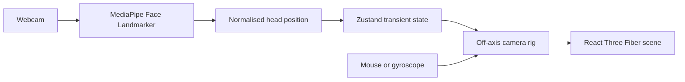

# RedBull F1 — Head-Tracked 3D Experience

An interactive WebGL experiment that turns the browser into a physical window around a Red Bull Formula 1 car. Webcam-based head tracking adjusts the scene perspective in real time; mouse and gyroscope controls provide fallbacks when camera access is unavailable.

**[Open the live experience](https://redbull-f1.vercel.app)**

## What makes it interesting

- Head-coupled perspective using MediaPipe face landmarks
- Off-axis camera projection with smoothed positional updates
- Detailed GLTF car rendered with React Three Fiber
- Cinematic lighting, reflections, bloom, fog, and vignette
- Mouse and device-orientation fallbacks
- Ignition sequence, spatial audio, HUD, loading, and error states

## Interaction pipeline



The webcam stream is used for client-side landmark detection. The interface requests permission before enabling tracking and retains non-camera input paths.

## Stack

- React and Vite
- Three.js with React Three Fiber
- React Three Drei and postprocessing
- MediaPipe Tasks Vision
- Zustand

## Run locally

```bash
git clone https://github.com/Adityaraj0421/RedbullF1.git
cd RedbullF1
npm install
npm run dev
```

Create a production build with:

```bash
npm run build
```

## Project structure

```text
src/
├── components/
│   ├── F1Car.jsx
│   ├── FaceTracker.jsx
│   ├── GyroTracker.jsx
│   ├── OffAxisProjection.jsx
│   ├── Stage.jsx
│   └── F1HUD.jsx
├── App.jsx
├── store.js
└── index.css
```

This is an independent experimental project and is not affiliated with Red Bull Racing or Formula 1.
